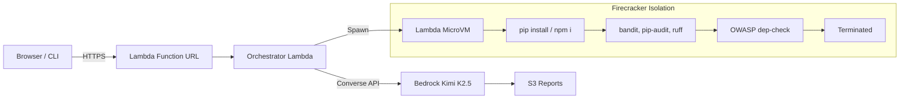

# AI Code Review Sandbox

Scan **PyPI, npm, Maven & Git repos** for vulnerabilities — each scan runs in its own isolated Firecracker MicroVM. Install packages, run security tools, get AI-powered analysis — all destroyed after.

**Repo:** [github.com/aquavis12/AI-Code-Review-Sandbox](https://github.com/aquavis12/AI-Code-Review-Sandbox)

[](https://docs.aws.amazon.com/lambda/latest/dg/lambda-microvms-guide.html) [](https://aws.amazon.com/bedrock/) [](LICENSE)

---

## Architecture



**Flow:** User → Function URL → Orchestrator → Spawn MicroVM → Run Scans → Terminate VM → AI Review → Return Report

> **Lambda Layer** provides `requests` + latest `boto3` (with MicroVMs API support) to the orchestrator — keeps the deployment zip lean and dependencies reusable.

---

## What It Scans

| Target | Checks |
|--------|--------|
| **PyPI** | Vulnerabilities, malicious code, typosquatting, license, OWASP |
| **npm** | npm audit, install scripts, dependency tree, CVEs |
| **Maven** | OWASP dependency-check, NVD CVE lookup, transitive deps |
| **Git repo** | bandit, ruff, secrets detection, dependency audit |


---

## Quick Start

```bash
curl -X POST https://YOUR_FUNCTION_URL/scan \
  -H 'Content-Type: application/json' \
  -d '{"target": {"type": "pypi", "name": "requests", "checks": ["security", "owasp"]}}'
```

**Response:**
```json
{
  "risk_level": "low",
  "ai_summary": "Package is well-maintained with no known vulnerabilities...",
  "findings": { "security": { "critical": 0, "high": 0, "medium": 1 } },
  "recommendations": ["Pin urllib3 to avoid CVE-2023-45803"]
}
```

---

## Why Lambda MicroVMs

| Without Isolation | With MicroVMs |
|-------------------|---------------|
| Malicious pkg infects shared runtime | Contained in its own VM |
| Install scripts can escape | Firecracker sandbox boundary |
| Cross-contamination between scans | Each scan = fresh VM, destroyed after |

---

## Project Structure

```
├── frontend/index.html          # Web UI
├── microvm-image/
│   ├── Dockerfile               # MicroVM image (Python + Node + Maven)
│   └── server.py                # HTTP exec server inside VM
├── src/orchestrator/
│   ├── app.py                   # Lambda handler (/scan, /review)
│   ├── scanners.py              # Scan steps per package type
│   ├── microvm_client.py        # MicroVM lifecycle (spawn/exec/terminate)
│   ├── context_skills.py        # Ecosystem + package context for AI
│   └── reviewer.py              # Bedrock Kimi K2.5 integration
├── .github/workflows/
│   └── deploy.yml               # CI/CD (GitHub OIDC → AWS)
├── docs/
│   ├── architecture.md          # Detailed diagrams
│   ├── MANUAL-SETUP-GUIDE.md    # Step-by-step AWS Console setup
│   ├── adr/
│   │   └── 001-context-skills.md # Architecture Decision Record
│   └── MANUAL-SETUP-GUIDE.docx  # Word version
└── scripts/                     # Deploy & test scripts
```

---

## Deploy

### CI/CD (Automated)

Push to `main` triggers GitHub Actions → builds layer → deploys Lambda → syncs frontend. Uses GitHub OIDC for keyless AWS auth.

### Manual

```bash
# 1. Create Lambda Layer (requests + latest boto3)
pip install requests boto3 -t python/lib/python3.11/site-packages
zip -r layer.zip python/
aws lambda publish-layer-version --layer-name code-review-deps \
  --zip-file fileb://layer.zip --compatible-runtimes python3.11

# 2. Deploy orchestrator
cd src/orchestrator && zip -r ../../lambda.zip *.py && cd ../..
aws lambda update-function-code --function-name ai-code-review-sandbox-orchestrator \
  --zip-file fileb://lambda.zip

# 3. Build MicroVM image
aws lambda-microvms create-microvm-image --name code-review-sandbox \
  --code-artifact uri=s3://ARTIFACTS_BUCKET/microvm-image.zip \
  --base-image-arn arn:aws:lambda:us-east-1:aws:microvm-image:al2023-1
```

> Full console walkthrough: [`docs/MANUAL-SETUP-GUIDE.md`](docs/MANUAL-SETUP-GUIDE.md)

---

## Features

- Dark/Light theme toggle (persisted in localStorage)
- Scan history with re-view, download, delete
- Download reports as JSON or Markdown
- Real-time progress indicator during scans
- OWASP Top 10 mapping in AI analysis
- Context Skills — ecosystem + package-specific AI awareness
- Custom skill upload (`.md` files)
- S3 presigned URL for report downloads

---

## Context Skills

Context Skills give the AI reviewer **awareness of what it's scanning** before it analyzes results. This makes reports significantly more specific and actionable.

### Built-in Skills

| Skill | What it provides |
|-------|-----------------|
| **PyPI** | Python supply chain attacks, typosquatting patterns, known vulnerable libs |
| **npm** | Install hook risks, prototype pollution, child_process patterns |
| **Maven** | Deserialization CVEs, Log4Shell history, transitive dep risks |
| **Git** | Hardcoded secrets, injection patterns, SSRF indicators |
| **Package Intel** | Per-package context (e.g. "log4j-core < 2.17.1 = RCE") |

### Custom Skills (User-Uploaded)

Upload `.md` files with your own rules — org-specific compliance, internal package context, custom patterns:

```bash
curl -X POST https://YOUR_FUNCTION_URL/skills \
  -H 'Content-Type: application/json' \
  -d '{
    "name": "global",
    "content": "## Internal Rules\n\n- All packages must be on approved vendor list\n- Flag any package < 6 months old"
  }'
```

**Naming:** `global.md` (all scans) | `pypi.md` (ecosystem) | `requests.md` (package-specific)

```bash
# List all skills
curl https://YOUR_FUNCTION_URL/skills
```

> ADR: [`docs/adr/001-context-skills.md`](docs/adr/001-context-skills.md)
- Supply chain risk detection

---

## Open Source

This project is fully open source under the MIT license. Contributions welcome:

- Fork the repo
- Create a feature branch
- Submit a PR

**Issues & feature requests:** [github.com/aquavis12/AI-Code-Review-Sandbox/issues](https://github.com/aquavis12/AI-Code-Review-Sandbox/issues)

---

## Blog

Full write-up with architecture deep-dive, screenshots, and lessons learned:
https://www.vishnurachapudi.com/blogs/lambda-MicroVMs/

---

## Cost

~**$0.01 per scan** (MicroVM compute + AI analysis combined)

---

## Author

Built by [Vishnu](https://github.com/aquavis12) — AWS Community Builder (Security) | 14x AWS Certified

## License

MIT
